# OpenVoiceChat

一个简单的实时语音聊天系统。


[](https://github.com/eric6227/OpenVoiceChat/pkgs/container/openvoicechat)

## 项目概述

OpenVoiceChat 是一个轻量级、低延迟的语音聊天解决方案，采用客户端-服务器-管理员三端架构。适用于团队协作、在线客服、语音会议等场景。

### 核心组件

| 组件 | 说明 | 端口 |
|------|------|------|
| **服务器 (Server)** | 音频数据转发、用户管理、设备指纹识别、封禁管理 | 9090 (客户端), 9091 (管理员) |
| **客户端 (Client)** | 用户语音聊天界面（GUI/CLI），支持独听、静音、音量调节 | 连接 9090 |
| **管理员 (Admin)** | 监控和管理界面，可踢人、封禁设备、查看在线用户 | 连接 9091 |

## 功能特性

### 实时通信
- 低延迟语音传输（基于TCP协议）
- 音频抖动缓冲（Jitter Buffer）平滑网络波动
- 音频包超时丢弃机制（200ms），防止延迟累积
- zlib音频压缩，减少带宽占用

### 安全特性
- **AES-256-GCM 加密传输**：所有音频数据端到端加密
- **PBKDF2-HMAC-SHA256 密钥派生**：100,000次迭代，从密码派生会话密钥
- **RSA-2048 公钥加密**：认证时加密密码传输
- **设备指纹识别**：基于MAC、CPU、主板、BIOS的硬件指纹
- **速率限制**：防止暴力破解（5次失败后封禁5分钟）
- **心跳检测**：10秒超时自动断开，防止未授权连接
- **Windows DPAPI**：安全存储本地密码
- **服务器公钥指纹验证**：类似SSH的信任机制

### 管理功能
- 实时在线用户监控
- 封禁设备（Ban）- 基于硬件指纹永久封禁
- 解除封禁（Unban）
- IP地址封禁（7天自动过期）
- 查看封禁列表

### 其他特性
- 图形化界面 (Tkinter GUI)
- 音量调节和增益控制
- 静音功能（全局/指定用户）
- 独听功能（Solo Mode，只听指定用户）
- 用户独立音量控制
- 本地监听（听自己的声音）
- 音频录制（可选，需用户同意）
- 配置文件持久化
- 已知服务器自动记忆
- 支持打包为独立可执行文件
- Docker 容器化部署（服务器端）

## 系统架构


### 端口说明

| 端口 | 协议 | 用途 |
|------|------|------|
| 9090 | TCP | 客户端连接（认证+音频数据） |
| 9091 | TCP | 管理员连接（认证+音频数据） |

## 技术栈

- **Python 3.11+**
- **PyAudio**: 音频采集和播放
- **PyCryptodome**: AES-256-GCM 加密、RSA 公钥加密
- **PyYAML**: 配置文件管理
- **Tkinter**: 图形用户界面
- **PyInstaller**: 可执行文件打包
- **Docker**: 服务器容器化
- **zlib**: 音频数据压缩

## 快速开始

### 前置要求

- Python 3.11 或更高版本（运行源码时需要）
- 麦克风设备
- 公网服务器（远程部署时需要）
- Docker 和 docker-compose（容器化部署时）

### 服务器端安装（推荐 Docker）

**方式一：使用 docker-compose（推荐）**

1. 确保已安装 Docker 和 docker-compose

2. 在项目根目录创建 `docker-compose.yml` 文件，内容如下：

```yaml
version: '3.8'

services:
  openvoicechat-server:
    image: ghcr.io/eric6227/openvoicechat:latest
    container_name: openvoicechat-server
    environment:
      # 必须使用环境变量注入密码，且务必使用强密码
      - OVC_PASSWORD=your_password_here
      # 必须使用环境变量注入密码，且务必使用强密码
      - OVC_ADMIN_PASSWORD=your_admin_password_here
      # 是否启用音频录制 True/False
      - OVC_RECORDING_ENABLED=false
      - OVC_RECORDING_DIR=/app/recordings
      - OVC_RECORDING_DURATION=5
      - OVC_RECORDING_MAX_SIZE=10240
      - OVC_RECORDING_RETENTION=30
    ports:
      - "9090:9090/tcp"
      - "9091:9091/tcp"
    volumes:
      - ./recordings:/app/recordings
    restart: unless-stopped
```

> **重要**：请将 `your_password_here` 和 `your_admin_password_here` 替换为强密码。
>
> 建议使用长度超过 24 个字符的字母、数字混合密码，不建议使用特殊字符，以免出现问题。
>
> 提示：若要开启录制，请与用户确认，确保用户同意。

3. 启动服务：

```bash
docker-compose up -d
```

4. 查看日志确认服务启动：

```bash
docker-compose logs -f
```

5. 停止服务：

```bash
docker-compose down
```

**方式二：使用 docker 命令**

```bash
# 在项目根目录下构建（注意 -f 指定 Dockerfile 路径）
docker build -t openvoicechat-server -f server/Dockerfile .

# 运行容器
docker run -d \
  --name openvoicechat-server \
  -e OVC_PASSWORD=your_password_here \
  -e OVC_ADMIN_PASSWORD=your_admin_password_here \
  -p 9090:9090/tcp \
  -p 9091:9091/tcp \
  openvoicechat-server
```

> **重要**：请将密码替换为强密码。

### 环境变量说明

服务器支持以下环境变量配置：

| 变量名 | 必填 | 默认值 | 说明 |
|--------|------|--------|------|
| `OVC_PASSWORD` | ✅ | 无 | 客户端连接密码 |
| `OVC_ADMIN_PASSWORD` | ✅ | 无 | 管理员连接密码 |
| `OVC_RECORDING_ENABLED` | ❌ | `false` | 是否启用音频录制 |
| `OVC_RECORDING_DIR` | ❌ | `./recordings` | 录音文件存储目录 |
| `OVC_RECORDING_DURATION` | ❌ | `5` | 单个录音文件时长（分钟） |
| `OVC_RECORDING_MAX_SIZE` | ❌ | `10240` | 录音文件最大总大小（MB，默认10GB） |
| `OVC_RECORDING_RETENTION` | ❌ | `30` | 录音文件保留天数（超过期限自动删除） |
| `OVC_REQUIRE_ADMIN` | ❌ | `true` | 管理员离线时是否断开所有客户端（设为 `false` 允许无管理员独立运行） |

> **注意**：`OVC_PASSWORD` 和 `OVC_ADMIN_PASSWORD` 是必填项，未设置时服务器将拒绝启动。

### 客户端安装（Windows 推荐 exe 安装包）

直接运行 release 界面的安装包：

- **客户端**：在 release 界面下载并运行 Client 的安装包
- **管理员**：在 release 界面下载并运行 Admin 的安装包

> **注意**：
> - 首次运行可能需要允许Windows防火墙访问网络
> - 安装包可选创建桌面快捷方式

### 客户端安装（其它平台运行源码）

```bash
# 克隆项目
git clone https://github.com/eric6227/OpenVoiceChat.git
cd OpenVoiceChat

# 安装依赖
cd client
pip install -r requirements.txt

# 启动客户端
python main.py
```

### 管理端安装（其它平台运行源码）

```bash
# 安装依赖
cd admin
pip install -r requirements.txt

# 启动管理员界面
python main.py
```

### 服务器端安装（从源码运行）

```bash
# 安装依赖（服务器需要 pycryptodome 和 shared 模块）
cd server
pip install -r requirements.txt

# 返回项目根目录，确保 shared 模块可用
cd ..

# 设置环境变量并启动服务器
# Windows (PowerShell):
$env:OVC_PASSWORD="your_strong_password_here"
$env:OVC_ADMIN_PASSWORD="your_strong_admin_password_here"
python server/main.py

# Linux/macOS:
export OVC_PASSWORD="your_strong_password_here"
export OVC_ADMIN_PASSWORD="your_strong_admin_password_here"
python server/main.py
```

> **注意**：从源码运行时，服务器需要访问项目根目录下的 `shared/` 模块，请确保从项目根目录启动，或保持目录结构完整。

### 打包为可执行文件

使用 PyInstaller 打包应用程序：

1. 略

### 创建 Windows 安装包（可选）

使用 Inno Setup 创建 Windows 安装程序：

1. 略

## 使用指南

### 客户端使用

1. **首次连接**：
   - 输入服务器地址和端口
   - 输入用户名和连接密码
   - 点击"连接"按钮
   - 验证服务器指纹
  
   > **注意**：首次连接时，务必验证服务器指纹。
   >
   > 指纹应当从可靠的、不可被篡改的渠道获得，如服务器官网或直接由管理员通过微信、QQ等社交软件告知。
   >
   > 获得的指纹只有前一部分，仅需对比客户端收到的指纹的前一部分即可。
   >
   > 若指纹不匹配，请不要连接，先向管理员确认你获得的指纹是否正确。若仍然不匹配，请不要连接，切换网络连接（如开启 VPN 或使用移动网络）进行尝试。只要指纹不匹配，就不能连接。
   >
   > 若连接指纹不匹配的服务器导致被中间人攻击，开发者概不负责。

   - **查看录音状态提示**：
     - 若服务器已开启录音：显示详细录音信息（目的、存储期限、方式、范围），需用户同意
     - 若服务器未开启录音：显示"未开启录音"提示
   - 用户同意后开始发送和接收音频

2. **音频控制**：
   - **静音**：点击用户旁的"M"按钮，停止接收该用户音频
   - **独听**：点击用户旁的"S"按钮，只听指定用户
   - **音量调节**：拖动滑块调整接收音量（全局）
   - **用户音量**：为每个用户独立调节音量
   - **增益控制**：调整麦克风输入增益
   - **本地监听**：听自己的声音，测试麦克风

3. **用户管理**：
   - 在线用户列表显示当前连接的用户
   - 可为每个用户单独设置静音和音量

4. **配置保存**：
   - 连接配置自动保存到 `config.yaml`
   - 已知服务器自动记录到 `known_servers.json`

### 管理员使用

1. **连接服务器**：
   - 输入服务器地址和端口
   - 输入管理员名称和管理员密码
   - 点击"连接"按钮

2. **监控功能**：
   - 实时查看所有在线用户
   - 监听所有用户或指定用户的音频
   - 查看用户加入/离开事件

3. **管理操作**：
   - **封禁设备**：点击用户昵称（列表最左边） → 封禁选中用户（基于硬件指纹，永久生效）
   - **解除封禁**：在封禁列表中点击解除
   - **静音用户**：点击用户旁的"M"按钮，停止接收该用户音频

4. **封禁列表**：
   - 硬件指纹封禁：永久生效
   - IP地址封禁：7天后自动过期
   - 查看封禁原因和时间

### 配置文件说明

> 配置文件会自动生成，无需手动配置

**客户端配置 (`client/config.yaml`)**：
```yaml
host: 127.0.0.1
port: 9090
name: 用户名
password_encrypted: <DPAPI加密后的密码>
mute_on_connect: false
mute: false
listen_own: false
volume: 1.0
gain: 1.0
```

**管理员配置 (`admin/config_admin.yaml`)**：
```yaml
host: 127.0.0.1
port: 9091
name: 管理员
password_encrypted: <DPAPI加密后的密码>
volume: 1.0
```

## 安全说明

- 所有音频数据使用 AES-256-GCM 加密传输
- 密码使用 PBKDF2-HMAC-SHA256 派生密钥（100,000 次迭代）
- Windows 平台支持 DPAPI 加密存储密码
- 心跳检测防止未授权连接
- 设备指纹识别防止恶意用户更换IP重新连接
- 速率限制防止暴力破解攻击

### 隐私保护

- 音频录制功能默认关闭
- 连接时自动显示录音状态提示
  - 服务器已开启录音：显示详细录音信息（目的、存储期限、方式、范围），需用户明确同意
  - 服务器未开启录音：显示"未开启录音"提示
- 启用录制需明确用户同意并遵守当地隐私法律
- 录音文件存储在服务器
- 录音目的：用于审查用户言论是否违规
- 录音方式：WAV格式，PCM 32-bit，16000Hz采样率，单声道
- 录音范围：用户发送的所有音频数据，解密后的原始音频保存到服务器
- 存储期限：录音文件最多保存 30 天，超过期限的文件将被自动删除
> 若不同意录音，则无法加入开启录音功能的服务器

## 常见问题

### 音频无法正常工作

- 检查麦克风权限
- 确认 PyAudio 已正确安装（若直接运行源码）
- Linux 用户可能需要安装 PortAudio：`sudo apt-get install portaudio19-dev`
- 检查音频设备是否被其他程序占用

### 连接失败

- 联系服务器管理员，确认服务器正在运行
- 检查防火墙设置，确保端口 9090/9091 已开放
- 验证配置中的服务器地址和端口
- 检查网络连接是否正常
- 删除安装目录下的 `known_servers.json` 文件，重新启动软件
> 默认安装目录：`C:\Users\用户名\AppData\Local\Programs\OpenVoiceChat-Client`或`C:\Users\用户名\AppData\Local\Programs\OpenVoiceChat-Admin`

### 服务器启动失败

- 确认已设置 `OVC_PASSWORD` 和 `OVC_ADMIN_PASSWORD` 环境变量
- 检查端口是否被其他程序占用
- Docker 部署时检查容器日志：`docker logs openvoicechat-server`

### 忘记密码

- 服务器端：重新设置环境变量并重启服务器
- 客户端：输入新密码

### 运行出错

- 确保已安装所有依赖：`pip install -r requirements.txt`
- Windows 用户可能需要安装 Visual C++ Redistributable
- 检查杀毒软件是否误删可执行文件

### 音频质量差

- 调整增益控制（Gain）避免音量过小
- 检查网络延迟和带宽
- 尝试调整抖动缓冲区大小（需修改源码）

### 项目结构

```mermaid
graph TD
    Root["📁 OpenVoiceChat/"]

    subgraph Shared["📦 shared/"]
        SH_Const["📄 constants.py<br/>消息协议常量"]
        SH_Crypto["📄 crypto.py<br/>AES-256-GCM 加密"]
        SH_Audio["📄 audio_utils.py<br/>音频压缩/抖动缓冲"]
        SH_Finger["📄 device_fingerprint.py<br/>设备指纹"]
        SH_Security["📄 security_utils.py<br/>DPAPI/指纹验证"]
    end

    subgraph Server["🖧 server/"]
        S_Main["📄 main.py<br/>服务器主程序"]
        S_Req["📋 requirements.txt<br/>服务器依赖"]
        S_Docker["🐳 Dockerfile<br/>Docker 配置"]
        S_Ban["🚫 ban_list.json<br/>封禁列表"]
        S_DevDB["🔍 device_fingerprints.json<br/>设备指纹库"]
        S_Rec["📁 recordings/<br/>录音文件目录"]
    end

    subgraph Client["👤 client/"]
        C_Main["📄 main.py<br/>客户端主程序"]
        C_Config["⚙️ config.yaml<br/>客户端配置"]
        C_Req["📋 requirements.txt<br/>客户端依赖"]
        C_Servers["📋 known_servers.json<br/>已知服务器"]
    end

    subgraph Admin["👨‍💼 admin/"]
        A_Main["📄 main.py<br/>管理员主程序"]
        A_Config["⚙️ config_admin.yaml<br/>管理员配置"]
        A_Req["📋 requirements.txt<br/>管理员依赖"]
        A_Servers["📋 known_servers_admin.json<br/>已知服务器"]
    end

    subgraph Build["📦 dist/ & build/"]
        B_Specs["📄 VoiceChatClient.spec<br/>📄 VoiceChatAdmin.spec<br/>PyInstaller 打包配置"]
        B_ISS["📄 OpenVoiceChatClient.iss<br/>📄 OpenVoiceChatAdmin.iss<br/>Inno Setup 安装脚本"]
        B_Output["📁 Output/<br/>安装包 .exe"]
    end

    Root --> Server
    Root --> Client
    Root --> Admin
    Root --> Shared
    Root --> Build

    Shared --> SH_Const
    Shared --> SH_Crypto
    Shared --> SH_Audio
    Shared --> SH_Finger
    Shared --> SH_Security

    Server --> S_Main
    Server --> S_Req
    Server --> S_Docker
    Server --> S_Ban
    Server --> S_DevDB
    Server --> S_Rec

    Client --> C_Main
    Client --> C_Config
    Client --> C_Req
    Client --> C_Servers

    Admin --> A_Main
    Admin --> A_Config
    Admin --> A_Req
    Admin --> A_Servers

    Build --> B_Specs
    Build --> B_ISS
    Build --> B_Output

    classDef rootClass fill:#e3f2fd,stroke:#0d47a1,stroke-width:3px
    classDef sharedClass fill:#e8eaf6,stroke:#283593,stroke-width:2px
    classDef serverClass fill:#fff3e0,stroke:#e65100,stroke-width:2px
    classDef clientClass fill:#e1f5fe,stroke:#01579b,stroke-width:2px
    classDef adminClass fill:#f3e5f5,stroke:#4a148c,stroke-width:2px
    classDef buildClass fill:#e8f5e9,stroke:#2e7d32,stroke-width:2px
    classDef fileClass fill:#fafafa,stroke:#757575,stroke-width:1px

    class Root rootClass
    class Shared sharedClass
    class Server serverClass
    class Client clientClass
    class Admin adminClass
    class Build buildClass
    class SH_Const,SH_Crypto,SH_Audio,SH_Finger,SH_Security,S_Main,S_Req,S_Docker,S_Ban,S_DevDB,S_Rec,C_Main,C_Config,C_Req,C_Servers,A_Main,A_Config,A_Req,A_Servers,B_Specs,B_ISS,B_Output fileClass
```



### 消息协议

系统使用自定义二进制协议进行通信：

| 消息类型 | 值 | 说明 |
|----------|-----|------|
| MSG_TYPE_JOIN | 1 | 客户端加入 |
| MSG_TYPE_AUDIO | 2 | 音频数据包 |
| MSG_TYPE_ADMIN_JOIN | 4 | 管理员加入 |
| MSG_TYPE_USER_LIST | 5 | 用户列表 |
| MSG_TYPE_USER_JOINED | 6 | 用户加入事件 |
| MSG_TYPE_HEARTBEAT | 7 | 心跳包 |
| MSG_TYPE_LEAVE | 8 | 用户离开 |
| MSG_TYPE_AUTH_SUCCESS | 9 | 认证成功 |
| MSG_TYPE_AUTH_FAIL | 10 | 认证失败 |
| MSG_TYPE_ADMIN_BAN | 11 | 封禁设备 |
| MSG_TYPE_ADMIN_KICK | 12 | 踢出用户 |
| MSG_TYPE_BANNED | 13 | 设备被封禁 |
| MSG_TYPE_ADMIN_GET_BAN_LIST | 14 | 获取封禁列表 |
| MSG_TYPE_BAN_LIST | 15 | 封禁列表数据 |
| MSG_TYPE_ADMIN_UNBAN | 16 | 解除封禁 |
| MSG_TYPE_ADMIN_NOT_ONLINE | 17 | 管理员不在线 |
| MSG_TYPE_RECORDING_NOTICE | 18 | 录音状态通知 |
| MSG_TYPE_RECORDING_CONSENT | 19 | 客户端录音同意响应 |

## AI声明

本项目使用AI编写，在人类指引下开发，经过人工验证

## 贡献

欢迎提交 Issue 和 Pull Request！

## 许可证

本项目采用 MIT 许可证。详见 [LICENSE](./LICENSE) 文件。