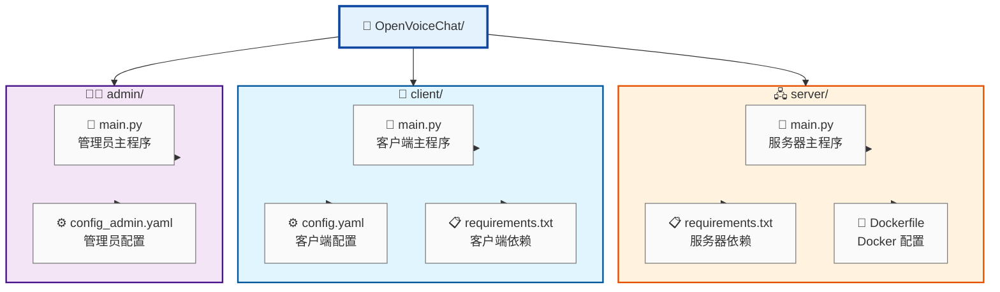

# OpenVoiceChat

一个基于TCP的实时语音聊天系统，支持客户端-服务器-管理员架构，采用AES-256-GCM加密保障通信安全。

## 项目概述

OpenVoiceChat 是一个轻量级的语音聊天解决方案，包含三个核心组件：

- **服务器 (Server)**: 负责音频数据转发和用户管理
- **客户端 (Client)**: 普通用户语音聊天界面
- **管理员 (Admin)**: 管理员监控和管理界面

## 功能特性

- 实时语音通信
- AES-256-GCM 加密传输
- 用户认证系统（连接时验证，生成会话密钥）
- 音频包超时丢弃机制（防止延迟累积）
- 图形化界面 (GUI)
- 支持打包为独立可执行文件
- Docker 容器化部署支持

## 系统架构


### 端口说明

| 端口 | 协议 | 用途 |
|------|------|------|
| 9090 | TCP | 客户端连接（认证+音频数据） |
| 9091 | TCP | 管理员连接（认证+音频数据） |

## 技术栈

- **Python 3.11+**
- **PyAudio**: 音频采集和播放
- **PyCryptodome**: AES-256-GCM 加密
- **Tkinter**: 图形用户界面
- **PyInstaller**: 可执行文件打包
- **Docker**: 服务器容器化

## 快速开始

### 前置要求

- Python 3.11 或更高版本（运行源码时需要）
- 麦克风设备
- 公网服务器

### 服务器端安装（推荐 Docker）

**方式一：使用 docker-compose（推荐）**

1. 确保已安装 Docker 和 docker-compose

2. 在项目根目录创建 `docker-compose.yml` 文件，内容如下：

```yaml
version: '3.8'

services:
  openvoicechat-server:
    image: ghcr.io/eric6227/openvoicechat:latest
    container_name: openvoicechat-server
    environment:
      - OVC_PASSWORD=your_password_here
    ports:
      - "9090:9090/tcp"
      - "9091:9091/tcp"
    restart: unless-stopped
```

> 注意：请将 `your_password_here` 替换为你的实际密码。

3. 启动服务：

```bash
docker-compose up -d
```

4. 查看日志确认服务启动：

```bash
docker-compose logs -f
```

5. 停止服务：

```bash
docker-compose down
```

**方式二：使用 docker 命令**

```bash
docker run -d --name openvoicechat-server -e OVC_PASSWORD=your_password_here -p 9090:9090/tcp -p 9091:9091/tcp ghcr.io/eric6227/openvoicechat:latest
```

> 注意：请将 `your_password_here` 替换为你的实际密码。

### 客户端安装（Windows 推荐 exe）

直接运行 release 界面的安装包：

- **客户端**: 在 release 界面下载并运行 Client 的安装包
- **管理员**: 在 release 界面下载并运行 Admin 的安装包

> 注意：首次运行可能需要允许Windows防火墙访问网络。

### 客户端安装（其它平台运行源码）

```bash
# 安装依赖
cd client
pip install -r requirements.txt

# 启动客户端
python main.py
```

### 管理端安装（其它平台运行源码）

```bash
# 安装依赖
cd admin
pip install -r requirements.txt

# 启动管理员界面
python main.py
```

### 其它安装方式

<details>
<summary>服务器端 - 从源码运行</summary>

```bash
cd server
pip install -r requirements.txt
python main.py
```

</details>

<details>
<summary>客户端/管理端 - 从源码运行（Windows）</summary>

```bash
# 启动客户端
cd client
pip install -r requirements.txt
python main.py

# 启动管理员界面
cd admin
pip install -r requirements.txt
python main.py
```

</details>

<details>
<summary>打包为可执行文件</summary>

使用 PyInstaller 打包应用程序：

```bash
# 打包客户端
pyinstaller VoiceChatClient.spec

# 打包管理员
pyinstaller VoiceChatAdmin.spec
```

打包后的可执行文件位于 `dist/` 目录。

</details>

## 安全说明

- 所有音频数据使用 AES-256-GCM 加密传输
- 密码使用 PBKDF2-HMAC-SHA256 派生密钥（100,000 次迭代）
- Windows 平台支持 DPAPI 加密存储密码
- 心跳检测防止未授权连接

## 项目结构



## 常见问题

### 音频无法正常工作

- 检查麦克风权限
- 确认 PyAudio 已正确安装
- Linux 用户可能需要安装 PortAudio

### 连接失败

- 确认服务器正在运行
- 检查防火墙设置
- 验证配置中的主机地址和端口

## AI声明

本项目使用AI编写，在人类指引下开发，经过人工验证

## 许可证

本项目采用 MIT 许可证。详见 [LICENSE](./LICENSE) 文件。